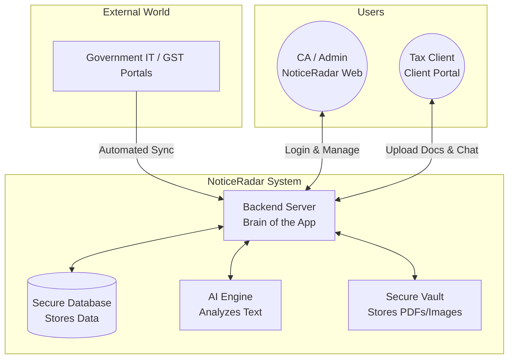
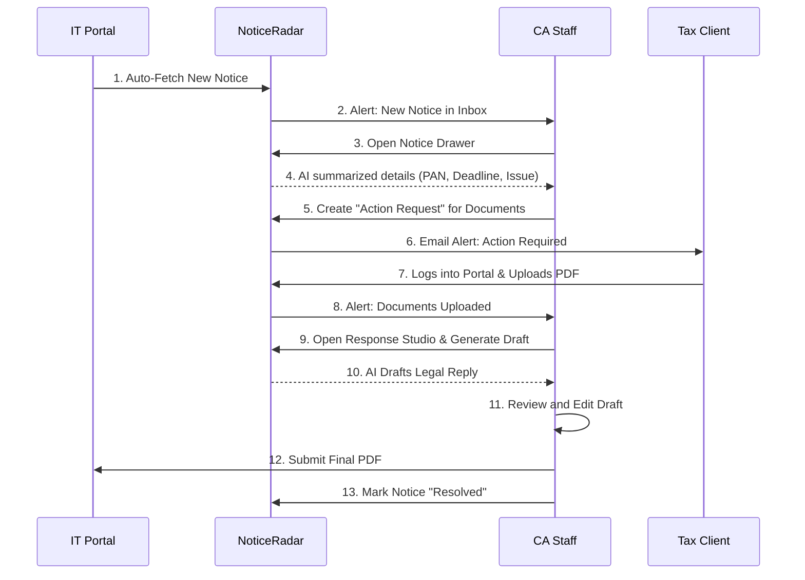

# NoticeRadar: The Complete End-to-End Guide

Welcome to the comprehensive guide for **NoticeRadar**. This document is designed to be easily understood by anyone—whether you are a seasoned software engineer, a Chartered Accountant (CA), or completely new to programming. 

This guide explains what we have built, how all the different pieces fit together, the features included, the security measures in place, and exactly how this software helps CA firms and their clients manage compliance effectively.

---

## 1. What is NoticeRadar?

**NoticeRadar** is a specialized, secure web application built for Chartered Accountants and Tax Professionals. 

* **The Problem:** CAs handle hundreds of clients. When the government (like the Income Tax Department or GST portal) issues a "Notice" (a formal letter asking for clarification, documents, or payments), it is often chaotic. CAs have to constantly log into different client portals, download notices, figure out what they mean, ask the client for documents, draft a reply, and submit it before a strict deadline.
* **The Solution:** NoticeRadar automates this entire lifecycle. It fetches notices automatically, uses Artificial Intelligence (AI) to summarize what the notice is about, provides a secure portal for CAs to chat with their clients and request documents, and even helps generate the legally formatted response.

---

## 2. High-Level Architecture (How it connects)

Here is a simple block diagram showing how the different parts of the system interact with each other.

---

## 3. Technology Stack: What is built with what?

To build this, we used modern, industry-standard technologies. Here is a comprehensive breakdown of the tools used and their exact purpose in the project:

### Frontend (The User Interface - What you see)
* **React.js:** The main framework used for building interactive, fast-loading user interfaces without constantly refreshing the browser page.
* **React Router:** Handles the navigation. It controls which page component (e.g., Dashboard or Login) should be shown based on the current URL.
* **Tailwind CSS & Vanilla CSS:** Used for custom styling, making the application look beautiful, modern, and perfectly responsive on all screen sizes.
* **Axios:** The HTTP client used to seamlessly make requests to the backend server and handle API responses.
* **@tanstack/react-query:** Used for caching data and managing states. It ensures the app doesn't refetch data unnecessarily, making it incredibly fast.
* **Lucide React:** A library of clean, professional SVG icons (like the search glass, upload arrow, user profile, etc.) used throughout the platform.
* **Recharts:** Used to render beautiful charts and graphs on the Dashboard to visualize data (like "Notices Resolved vs Pending").
* **React Hot Toast:** Provides the elegant pop-up notification alerts (success, errors) in the corner of the screen when actions are taken.

### Backend (The Server - The Brain)
* **Node.js & Express.js:** Node is the engine that runs on the server. Express is the framework that listens for HTTP requests from the frontend and processes them.
* **Mongoose:** The Object Data Modeling (ODM) library acting as a translator between our Node.js server and the database, ensuring strict data schemas.
* **JSON Web Tokens (JWT):** The digital "ID cards" used to securely authenticate users and maintain their login sessions.
* **Bcrypt & Crypto:** Cryptography libraries used to securely hash user passwords and encrypt sensitive client IT-Portal credentials (AES-256).
* **Zod:** A schema validation library that rigorously checks input data (like ensuring an email is really an email, and all required environment variables exist) before the server processes it.
* **Multer:** A middleware for handling `multipart/form-data`, which is primarily used for uploading files (Notice PDFs, receipts) securely.

### Database & Storage
* **MongoDB:** A NoSQL database that stores all text data flexibly as JSON-like documents (User profiles, Notice details, Chat messages).
* **AWS S3 / MinIO:** Object storage used as a "Document Vault" to securely store the actual files (PDFs, Images of notices, Uploaded receipts).

### Security Specific Libraries
* **Helmet:** Secures the Express apps by setting 11 different HTTP response headers.
* **express-mongo-sanitize:** Sanitizes data to prevent NoSQL injection attacks.
* **xss-clean:** Sanitizes input data against cross-site scripting (XSS) attacks.
* **express-rate-limit:** Limits repeated requests to public APIs to prevent brute-force attacks.
* **cors:** Controls which domains are legally allowed to interact with the backend API.

---

## 4. Complete Feature List

Here is an exhaustive list of the primary features built into the NoticeRadar platform:

### 🚀 Automation & AI Features
* **1. Automated Portal Sync (RPA Automation):** Securely stores client Income Tax login credentials, allowing the system to automatically scrape the government portal to fetch new notices.
* **2. Quick Scan & Auto-Extract (OCR):** Upload a scanned physical paper notice; the OCR engine reads the image and auto-populates forms (Notice No, PAN, Due Date).
* **3. AI Notice Summarization:** Uses AI to read complex 10-page legal notices and summarize them into brief, easy-to-understand bullet points highlighting the exact issue and deadline.
* **4. AI Response Studio:** Automatically drafts a polite, legally-sound reply letter based on the notice context and uploaded documents.

### 📥 Notice & Workflow Management
* **5. Centralized Notice Inbox:** A clean interface to view all notices across all clients, sortable by urgency, status, and department.
* **6. Notice Drawer Details:** A robust slide-out panel containing all metadata, AI insights, document attachments, activity history, and communication for a specific notice.
* **7. Interactive Notice Calendar:** A full-page calendar view plotting notices by their strict due dates to visually manage deadlines.
* **8. Bulk Actions:** Select multiple notices in the inbox to assign them to specific staff in bulk or update their status simultaneously.

### � Client Collaboration & Portal
* **9. Action Requests:** CA staff can create formal requests tied directly to a notice asking the client to upload specific documents (e.g., "Upload 80C Proofs").
* **10. Dedicated Client Portal:** A separate, simplified login experience where Tax Clients can view the status of their notices and fulfill document requests safely.
* **11. Comments & Real-time Chat:** A thread inside each notice allowing staff and clients to communicate without losing context in messy email chains.
* **12. Automated Email Alerts:** System sends out automated email notifications for approaching deadlines, new document uploads, or when a notice is resolved.

### ⚙️ Administration & Organization Data
* **13. Dashboard & Analytics:** High-level statistical charts summarizing organizational performance (Notices resolved, overdue notices, average response time).
* **14. User & Role Management:** Admins can invite staff members, assign roles, and revoke access instantly. 
* **15. Client Directory Management:** A dedicated page to manage the CA firm's entire client database, their PAN cards, entity types, and portal credentials.
* **16. Template Management:** Admins can build and save customized boilerplate templates for standard legal replies (e.g., standard GST reply template).

### 🛡️ Security & Auditing
* **17. Document Vault:** Secure, centralized AWS S3 file storage explicitly for sensitive client documents with controlled access.
* **18. Forensic Audit Trail:** Immutable logging of every system mutation down to the IP address (who logged in, who deleted a document, who synced the portal).
* **19. Multi-Factor Authentication (MFA):** Optional secondary code (Google Authenticator) enforcement for user logins.

---

## 5. Security Features (Enterprise Grade)

Because we handle sensitive financial data (PAN cards, tax logs), security is our top priority. We use several industry-standard tools to lock the system down:

1. **Role-Based Access Control (RBAC):** We have different user types. A "Super Admin" can see everything. A "Staff Member" can only see notices assigned to them. A "Client" can only see their own notices.
2. **Data Encryption (`crypto`, `bcrypt`):** Passwords and sensitive IT portal credentials are encrypted before being saved to the database. Even if the database is stolen, the hackers cannot read the passwords. We use `bcrypt` for one-way password hashing and `AES-256` for two-way credentials encryption.
3. **MFA (Multi-Factor Authentication):** Users can link Google Authenticator to their account, requiring a changing 6-digit code on top of their password to log in.
4. **Helmet API Security:** Helmet is a piece of software that hides the fact that we are using Node.js, and sets 11 different HTTP security headers to stop hackers from tricking the browser into doing things it shouldn't.
5. **Database Injection Protection (`express-mongo-sanitize`):** Unlike older databases that suffer from SQL Injection, we use MongoDB. We use `mongo-sanitize` to strip out any malicious database commands typed into search boxes or forms to prevent NoSQL Injection.
6. **Cross-Site Scripting Protection (`xss-clean`):** Software filters clean all data coming into the server to ensure users aren't typing malicious JavaScript code into our text boxes to hack other users' browsers.
7. **Rate Limiting (`express-rate-limit`):** Prevents hackers from guessing passwords rapidly (Brute Force attacks) by locking out an IP address after too many failed login attempts within a specific time window.
8. **CORS (Cross-Origin Resource Sharing):** We explicitly configure our server to only accept requests coming from our allowed frontend domain. Any request originating from a suspicious, different domain is rejected.

---

## 6. Project Structure: A Complete Deep Dive

For a developer working on the project, the code is split into two massive folders: `server` (Backend APIs) and `web` (Frontend UI). Here is the exact breakdown of every folder and what those files do:

### `server/` (The Node.js & Express Backend)
This acts as the brain of the app. It holds the logic, talks to the database, and enforces security.

* `src/app.js` & `src/server.js`: The starting points. This is where the server is booted up, where the database connection happens, and where all the security guards (Helmet, CORS, Rate Limiters) are stationed.
* `src/config/`: Configuration files for the app. 
  * `db.js`: Code to talk securely to MongoDB.
  * `env.js`: Built with a tool called `zod`, ensures all environment variables (API keys, secrets) are present and correct before the server is allowed to start.
* `src/models/`: The Database blueprints. Example: `Notice.js` models a notice with strict rules (Needs a PIN, Assessment Year) before the database saves it. `AuditLog.js` structures the forensic records.
* `src/routes/`: The street signs. Think of a URL like `/api/notices`. These files route that URL to the correct specific function that handles Notices.
* `src/controllers/`: The traffic cops. Examples: `notices.controller.js` and `auth.controller.js`. When a request comes in, the controller receives the data, asks the Services for the heavy lifting, and sends a formatted JSON response back to the user.
* `src/services/`: The actual heavy lifters and muscle. 
  * `ai.service.js`: Talks to the AI API (like Anthropic/OpenAI) to summarize documents.
  * `auth.service.js`: Handles checking passwords mapping JWT tokens.
  * `encryption.service.js`: Used to scramble and descramble Portal credentials (AES-256).
* `src/middleware/`: Security checkpoints that sit *between* the route and the controller. 
  * `auth.middleware.js`: Intercepts the request to make sure the user's JWT token is completely valid. If not, rejects immediately with "Unauthorized 401".
  * `upload.middleware.js`: Limits file uploads (e.g., to 10MB, strictly PDFs or images) to prevent malicious software uploads.

### `web/` (The React.js Frontend)
This is everything the user sees, clicks, and interacts with in their browser.

* `src/index.js` & `src/App.js`: The entry points. `App.js` holds the router, which dictates exactly which Page component to load depending on what the URL says in the browser's address bar.
* `src/api/` (`axios.js`, `endpoints.js`): The phone book. Holds the settings to make HTTPS calls back to the `server/`. It automatically injects the user's secret Bearer token into every request they make.
* `src/auth/` (`AuthContext.js`, `ProtectedRoute.js`): The bouncers. They wrap around the application to hold onto the user's login state globally. `ProtectedRoute` automatically kicks unauthenticated users back to the `/login` screen.
* `src/layouts/`: The frames. `AppLayout.js` comprises the top navigation bar and sidebar that stay constant while the center screen changes when CA Staff uses it. `ClientPortalLayout.js` handles the simplified interface that non-CA clients see.
* `src/pages/`: The core application screens. Every folder here represents a major feature feature:
  * `Admin/`: (`AuditLogs.js`, `ForensicLogs.js`, `UserManagement.js`) - SuperAdmin only pages to view immutable logs and control access.
  * `ClientPortal/`: The entirely separate, simplified app experience for clients. Includes `ClientDashboard.js` and `ClientNoticeDetails.js` for them to talk to their CA.
  * `Clients/`: The `ClientList.js` to manage their CA client base.
  * `Dashboard/`: High level charts and stats `DashboardStats.js`.
  * `Notices/`: The heavy hitter section. Inbox (`NoticeInbox.js`), OCR automation (`QuickScanNotice.js`), Calendar view (`NoticeCalendar.js`), and the pop out side-panel for notices (`NoticeDrawer.js`). 
  * `Responses/`: `ResponseStudio.js` - the rich text editor where the AI builds the legal drafting for a reply.
  * `Tools/`: RPA functionality like `PortalSync.js` to trigger a mass scrape/sync of government portals.
* `src/styles/`: All the CSS styling. `theme.css` outlines the global colors (blues, off-whites, greys), fonts, and border-radiuses that make the application look like a premium SaaS product.

---

## 7. The Complete Lifecycle of Data (How information flows)

Understanding exactly how a piece of data (a legal notice or a document) enters the system, travels between the CA and the Client, and exits the system is crucial. Here is the step-by-step reality of how NoticeRadar handles data.

### Step 1: The Origin (Where do Notices come from?)
Notices enter the CA's ecosystem in one of two ways:
1. **Digital (Automated RPA Sync):** The CA has already saved the Client's Income Tax Portal credentials inside NoticeRadar. Every night, the NoticeRadar backend acts like a robotic user (RPA). It silently logs into `incometax.gov.in`, checks for new messages, downloads any new notice PDFs, extracts the basic data (Notice Number, PAN, Due Date), and saves everything into our MongoDB database. 
2. **Physical (OCR Scan):** A client physically hands a letter to the CA. The CA scans it into a PDF and clicks "Quick Scan" in NoticeRadar. Our OCR engine "reads" the document like a human, converts the picture into text, and saves it into the database.

### Step 2: The CA's Dashboard (How the CA receives the data)
Once the database has the notice, it instantly appears in the primary CA interface: **The Notice Inbox**. 
* The CA sees a list sorted by urgency (e.g., Red for "Due Tomorrow").
* **AI Analysis:** The CA clicks the notice to open the *Notice Drawer*. At this exact moment, NoticeRadar sends the raw text of the 10-page notice to our AI Engine. The AI sends back a 3-bullet-point summary ("This is a section 143(1) intimation. There is a mismatch in TDS. They need Form 16."). 
* The CA now understands the problem in 10 seconds without reading the legal jargon.

### Step 3: Client Communication (How data flows to the Tax Client)
To respond to the government, the CA needs documents (like rent receipts or Form 16) from the Tax Client.
1. **The Request:** Inside the Notice Drawer, the CA clicks "Create Action Request" and types: "Please upload your rent receipts for 2023."
2. **The Alert:** NoticeRadar's backend immediately sends an email to the Tax Client: "Your CA has requested a document to resolve Note #ITBA-123. Click here to upload."
3. **The Upload:** The client does *not* need to understand the complex CA dashboard. They log into their own super-simple **Client Portal**. They see a clean screen saying "Pending Request: Rent Receipts." They drag-and-drop their PDF.
4. **Secure Storage:** The moment the client hits upload, the PDF is encrypted and vaulted deep inside our AWS S3 Storage Server. It is attached directly to the Notice database record.

### Step 4: The Final Response (How it goes back to the Government)
The CA receives an alert that the client has uploaded the documents. It is time to draft the legal reply.
1. **The AI Generation:** The CA opens the **Response Studio**. They click "Auto-Draft". NoticeRadar bundles the original Notice Summary + the new Documents uploaded by the client and sends them to the AI Engine. The AI drafts a highly professional, legally formatted letter (e.g., "To the Assessing Officer, Please find attached the proofs of HRA...").
2. **The Edit & Finalization:** The CA reads the letter in the Rich Text Editor, fixes a few words, and clicks "Approve."
3. **The Export:** NoticeRadar generates a final, un-editable PDF on the CA's letterhead. 
4. **The Submission (The End):** The CA downloads this final PDF, logs into the Income Tax portal, replies to the specific government notice, and uploads the PDF. Finally, the CA clicks "Mark as Resolved" inside NoticeRadar. The data lifecycle is complete.

---

### Visualizing the Flow

