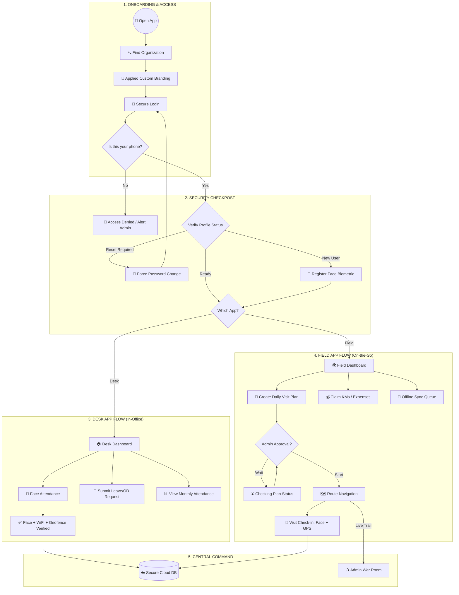

# LogDay System Architecture & Feature Flow

This document provides a high-level overview of the entire **LogDay** ecosystem, detailing the flows for both the **Desk App** and the **Field App**.

---

## 🏗️ Unified System Flow

---

## 🌟 Key Feature Highlights

### 1. Desk App: Enterprise Discipline
- **Zero-Trust Check-in**: Combines biometric face matching with strict geofencing and WiFi BSSID validation.
- **Privacy First**: Tracking only happens at the point of check-in/out.
- **Centralized Reports**: Full monthly breakdown available directly on the phone.

### 2. Field App: Productivity & Accuracy
- **Route Optimization**: Visualizes the daily schedule on a map with turn-by-turn navigation.
- **Smart End-Day**: Automatically calculates total KMs traveled from GPS pings for reimbursement.
- **Offline Mode**: Agents can work in areas with poor internet; data is automatically synced when a connection is restored.
- **Live Tracking**: Admins can see "Live Trails" of agents only during their active working hours.

### 3. Unified Backend (LogDay-API)
- **AI Engine**: DeepFace integration for sub-second biometric matching.
- **Alert System**: Triggers "High Importance" alerts for Mock Location, Device Mismatch, or Face Failures.
- **Multi-Tenant**: Dynamically segments data and branding based on the organization.

---
Created on: 2026-03-14
